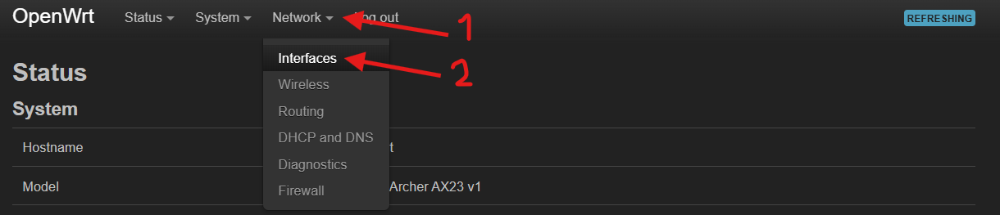
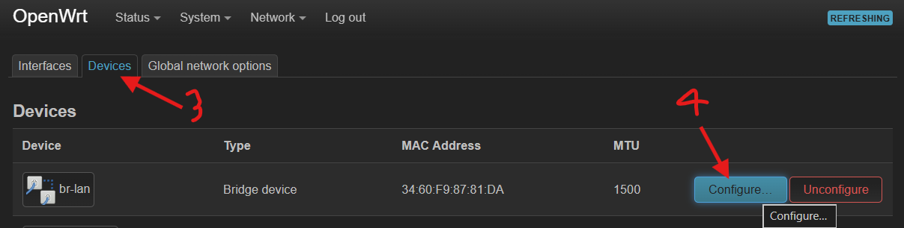
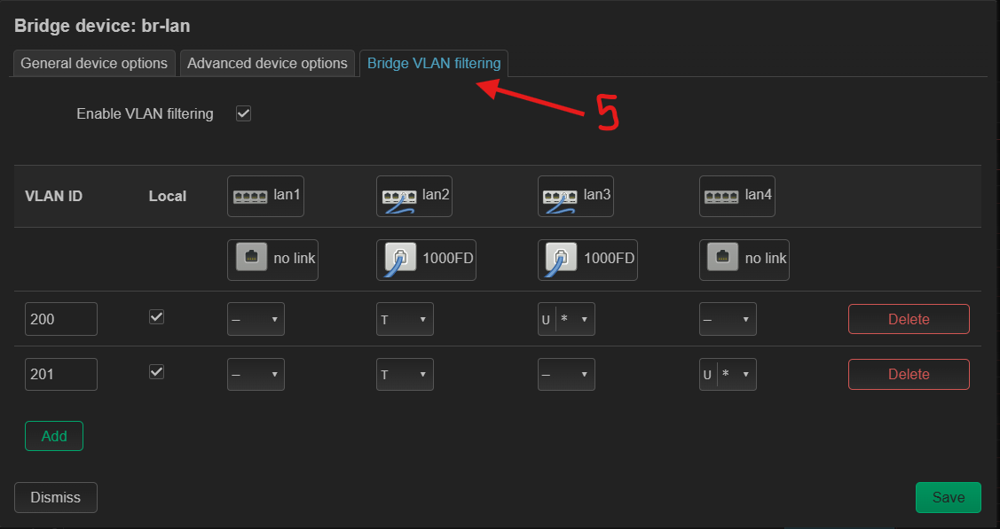

import { YouTube } from "astro-embed";

In my current network setup, I use an OPNsense router for routing and a TP-Link Archer AX23 running OpenWrt as an access point. OPNsense provides two VLANs, and I want to use the LAN ports on the OpenWrt device as a managed switch: one port as a trunk (tagged) uplink and other ports as access (untagged) ports.

# Existing Guide

<YouTube id="qeuZqRqH-ug" title="VLANs in OpenWrt 21" />
This video offers a great explanation of VLANs in OpenWrt.

# How to

> Note: Be careful when following guides online—many target older OpenWrt versions (pre-DSA, before the move to the Distributed Switch Architecture).

Go to **Network → Interfaces**.

Then open **Devices** and select your bridge device (for example, `br-lan`), which contains the router’s LAN ports.

Next, open the **Bridge VLAN filtering** tab.

Add the VLAN IDs you need (in my case, `200` and `201`). Then:

- Set **Tagged (T)** on the port you want to act as the trunk/uplink (for example, `lan2`).
- Set **Untagged (U)** on access ports. Devices connected to these ports will be placed into that VLAN, but they won’t need to understand VLAN tagging.

Also enable **Is Primary VLAN** on the access port so traffic is tagged correctly before it is forwarded.

That’s it—your OpenWrt device can now act as a simple managed switch.

# References

<YouTube
  id="https://www.youtube.com/watch?v=p7EWTbZfBKo"
  title="OpenWrt 21.02 DSA Switch config - VLAN and Bridging (english)
"
/>
