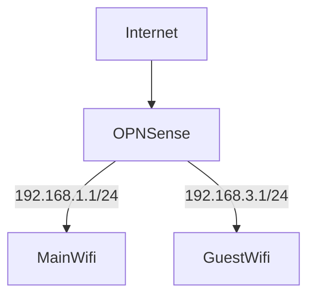
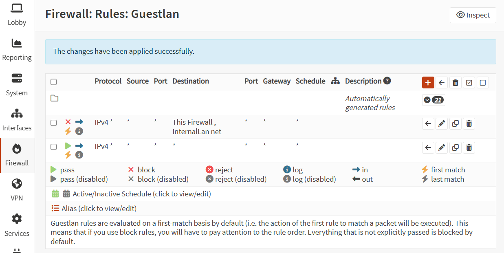

# Goal

This two network should be separated and it shouldn't be able to route to each other. I'll assign different interface to each of the network and each interface is connected to an access point.

By default, OPNsense route every network together (as it is a router!). To block traffic from going across network, we need to setup a firewall rule to prevent that.

# Existing Guide

[Setup a Guest Network - OPNsense docs](https://docs.opnsense.org/manual/how-tos/guestnet.html)  
[Isolating our Guest Wireless Network in OPNSense](https://www.bentasker.co.uk/posts/blog/house-stuff/creating-isolated-ipv4-and-ipv6-networks-with-vlans-and-opnsense.html)

From existing guide, it seems like the approach to be to create block rule to prevent GuestWifi to reach other network. Personally, I think it is quite prone to configuration mistake as you might miss some LAN when configurating or when adding new network. From chatting with ChatGPT another approach seems to be to block all traffic trying to reach local IP address range.

> Note:
> LAN net -> All device in LAN network
> LAN address -> Address of the firewall in that network
> [Reference - OPNsense forum](https://forum.opnsense.org/index.php?topic=38168.0)

# TODO

Make management interface not accessible

# Reference

[Firewall Rules - OPNsense docs](https://docs.opnsense.org/manual/firewall.html)
