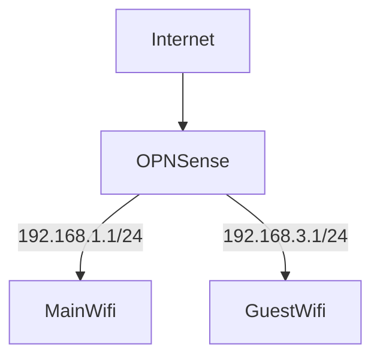

# Goal

These two networks should be separated, and they shouldn't be able to route to each other. I'll assign a different interface to each network, and each interface will be connected to an access point.

By default, OPNsense routes all networks together (as it is a router!). To stop traffic from crossing between networks, we need to set up firewall rules to prevent that.

# Existing Guide

[Setup a Guest Network - OPNsense docs](https://docs.opnsense.org/manual/how-tos/guestnet.html)  
[Isolating our Guest Wireless Network in OPNSense](https://www.bentasker.co.uk/posts/blog/house-stuff/creating-isolated-ipv4-and-ipv6-networks-with-vlans-and-opnsense.html)

From the existing guides, it seems the approach is to create a block rule to prevent GuestWifi from reaching the other network(s). Personally, I think this is prone to configuration mistakes—you might miss a LAN when configuring rules or when adding a new network. From chatting with ChatGPT, another approach seems to be blocking all traffic that tries to reach local IP address ranges.

> Note:  
> LAN net -> All device in LAN network  
> LAN address -> Address of the firewall in that network  
> [Reference: OPNsense forum](https://forum.opnsense.org/index.php?topic=38168.0)

There's a Destination called **This Firewall** which make the OPNsense web GUI not accessible, make sure to include that as well.

# Reference

[Firewall Rules - OPNsense docs](https://docs.opnsense.org/manual/firewall.html)
